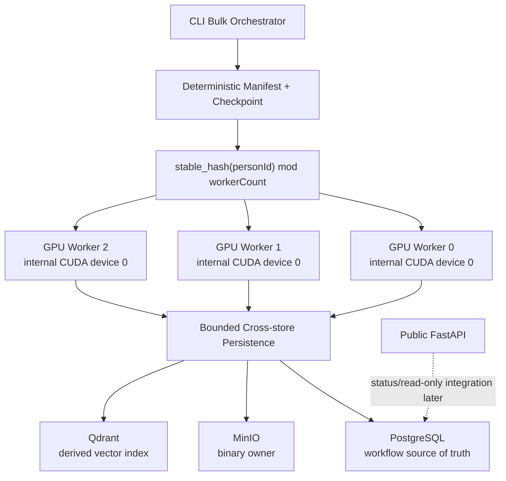

# Productionize Process-per-GPU Bulk Enrollment — Implementation Plan

> **Execution model:** Inline task-by-task in the same session. No separate autonomous worker delegation; no parallel-agent execution. Each gate produces a testable deliverable and ends with verification only (targeted tests, `git diff --check`, `git status --short`, changed-file list). No staging, committing, pushing, merging, resetting, or deleting without explicit user approval.

**Goal:** Make the measured process-per-GPU LFW bulk-enrollment result durable, semantically correct, and production-deployable — without changing models, input resolution, FP16 precision, TensorRT engine profiles, or UI.

**Architecture:** A CLI bulk orchestrator builds a deterministic person-based manifest, shards by stable hash, and dispatches compact job descriptors directly to three long-lived GPU worker containers over internal Docker-network HTTP. Each worker sees exactly one physical GPU (internal CUDA device 0), owns one warmed `GpuFacePipeline`, and persists to a single shared PostgreSQL/MinIO/Qdrant cluster. The public FastAPI control plane does not receive archives or relay bulk image data.

**Tech Stack:** FastAPI, SQLAlchemy 2.0 asyncio, Alembic, AsyncQdrantClient, MinIO S3, Docker Compose, TensorRT direct device binding, custom `mergenvision_gpu` CUDA extension.

## Global Constraints

- Do **not** commit, push, merge, reset, delete volumes, delete artifacts, or modify requirements/architecture without explicit user approval.
- Local commits `36b11a4` and `3a99dfa` must remain unpushed.
- Do **not** begin UI work or Phase 2 in this sprint.
- Do **not** change detector, recognizer, input resolution, FP16 precision, or TensorRT engine profiles.
- Do **not** claim `GPU_ONLY`, `E2E durable`, `production-ready`, or `<30 s` accepted until every acceptance gate passes.
- Target: durable 3-GPU steady-state full E2E wall time < 30 s for 13,233 LFW photos.
- Process topology: one PostgreSQL, one MinIO, one Qdrant; **not** one persistence stack per GPU.
- Device-side face selection is an architectural requirement; CPU selection is allowed only as a reference oracle in tests.
- Qdrant durable boundary for Phase 1 uses bounded-batch `wait=True`.
- GPU discovery is read-only via `nvidia-smi`; no UUID or count is hardcoded in source or Compose.
- CLI dispatches directly to internal GPU workers; FastAPI does not proxy bulk data.
- Deterministic IDs and idempotent rerun.
- If durable E2E exceeds 30 s, report the honest number, bottleneck, and a `PARTIAL` verdict.
- This sprint produces the bulk/scale vertical; it does not claim Milestone 2 UI polish or process-history API completion.

## Baseline Evidence (preserve and compare against)

| Metric | Value | Notes |
|---|---|---|
| thread-based 3-GPU durable-looking run | ~54 s | flawed baseline; shared GIL/engine/runtime contention |
| process-per-GPU compute-only 3 GPU | ~13.22 s | no persistence |
| process-per-GPU E2E 3 GPU first run | 21.20 s | 624.2 images/s |
| process-per-GPU E2E 3 GPU repeated run | **20.83 s** | **635.3 images/s** |
| per-worker extraction critical path | 15.488 s | max of gpu0–gpu2 |
| per-worker persistence critical path | 12.574 s | max of gpu0–gpu2 |
| nvidia-smi avg utilization | 38–44 % | includes init/warmup/persistence/tail; do not conclude IO-bound |

Both 21.20 s and 20.83 s results are **BASELINE_NOT_DURABLE** because Qdrant used `wait=False` and no complete cross-store audit was shown.

## File Map

| File | Responsibility |
|---|---|
| `backend/app/bulk/models.py` | Pydantic/CLI models for bulk items, manifest, job descriptors. |
| `backend/app/bulk/sharding.py` | Deterministic UUIDv5 person IDs and stable shard hashing. |
| `backend/app/bulk/manifest.py` | LFW manifest builder; maps folders to synthetic external IDs. |
| `backend/app/bulk/persistence.py` | Idempotent staged cross-store write for one batch. |
| `backend/app/bulk/bulk_enrollment_service.py` | CLI-orchestrator logic: manifest, checkpoint, retry, aggregation. |
| `backend/app/bulk/worker_runtime.py` | Worker HTTP handlers and lifecycle wiring. |
| `backend/app/bulk/telemetry.py` | Worker timestamp emission and GPU/host sampler. |
| `backend/app/ml/gpu/buffer_arena.py` | Event-fenced `BufferLease` ownership. |
| `backend/app/ml/gpu/device_tensor.py` | View wrapper; never frees arena-owned memory. |
| `backend/app/ml/gpu/face_pipeline.py` | Correct create/warmup/infer/close order. |
| `backend/app/ml/gpu/decoder.py` | Safe nvImageCodec teardown on owning device. |
| `backend/app/ml/gpu/trt_device_engine.py` | Stream sync before context/engine destruction. |
| `backend/app/ml/gpu/recognizer.py` | Recognizer arena close after engine close. |
| `backend/app/ml/gpu/retinaface_postprocess.py` | Device-side selection; contiguous/batched target. |
| `backend/native/mergenvision_gpu/src/retinaface_pick_largest.cu` | Selection kernel; A/B decides keep/rewrite. |
| `backend/app/infrastructure/qdrant.py` | `upsert_batch(..., wait=True)` default. |
| `backend/scripts/profile_compute_only.py` | Compute-only benchmark; lifecycle test path. |
| `backend/scripts/benchmark_bulk_enroll_multiprocess.py` | Kept as local multiprocess reference only. |
| `backend/scripts/bulk_cli.py` | CLI orchestrator entry point. |
| `backend/scripts/benchmark_throughput.py` | Durable throughput mode against workers. |
| `backend/scripts/benchmark_accuracy.py` | Held-out accuracy mode; separate from throughput. |
| `backend/app/workers/gpu_worker.py` | Long-lived worker FastAPI app. |
| `docker-compose.yml` / `docker-compose.benchmark.yml` | Worker services and isolated benchmark profile. |
| `backend/native/mergenvision_gpu/src/test_helpers.cu` | Test-only deterministic GPU spin helper. |
| `backend/tests/ml/gpu/test_buffer_arena_lifetime.py` | Lease event-fencing, lifetime, and subprocess tests. |
| `backend/tests/bulk/test_bulk_persistence.py` | Unit/monkeypatch persistence failure tests. |
| `backend/tests/bulk/test_bulk_persistence_integration.py` | Real cross-store recovery acceptance tests. |
| `backend/docs/implementation/review_packages/SPRINT-002-CODE-REVIEW-PACKAGE.md` | Immutable sprint package. |
| `backend/docs/implementation/CURRENT_SPRINT.md` | Short active sprint plan per AGENTS.md. |
| `backend/docs/implementation/IMPLEMENTATION_DETAILS.md` | Outcome log per AGENTS.md. |

## Source-of-Truth Hierarchy

Approved order (current explicit user decision overrides all):

1. Current explicit user decision.
2. `requirements/phase1requirements.md`.
3. Approved `architecture/01` through `architecture/06` documents (if present).
4. Approved `backend/docs/implementation/CURRENT_SPRINT.md`.
5. Non-conflicting legacy behavior from `requirements/ProjectRequirements.md`.
6. `phase2requirements.md` only for future compatibility.
7. `opensourcereferences/references.md` and official upstream sources.
8. Old repositories as read-only evidence.

`AGENTS.md` governs workflow rules (git, MCP, tests, reporting); it is **not** an approved ERD unless a section explicitly freezes the exact table/column contract. As of Gate 0, no `architecture/01`–`architecture/06` documents were found in the repository.

`ProjectRequirements.md` mentions process IDs, logging, and `GET /processes/{processId}`, but those clauses are legacy/lower-priority and cannot by themselves authorize new tables or columns.

---

## Gate 0 — Repository, Schema and Baseline Audit

**Files:** read-only inspection of existing commits, migrations, requirements, current code.

**Interfaces:** none new.

### Step 1: Verify local commits and worktree

Run:

```bash
git log --oneline -5
git status --short
git diff --check
```

Expected: HEAD is `3a99dfa`; benchmark scripts exist; no uncommitted source changes except untracked plan/frontend-report dirs; no whitespace errors.

### Step 2: Source-of-truth matrix for schema

Read and compare:
- `AGENTS.md`
- `requirements/phase1requirements.md`
- `requirements/ProjectRequirements.md`
- `backend/alembic/versions/0001_phase1.py`
- `backend/app/domain/models.py`
- any approved architecture/ERD document (if present)

Fill and record this matrix before any schema change. Every row must cite exact file path and line/section evidence. “Mentioned” is not “approved contract”.

| Behavior / table / column | phase1requirements | approved architecture/ERD | current migration/model | Decision |
|---|---|---|---|---|
| `person` table | REQ-004 (`requirements/phase1requirements.md:9-11`) | **not found** | `backend/alembic/versions/0001_phase1.py:20-42` / `backend/app/domain/models.py:24-59` | Aligned for current scope |
| `person_photo` table | REQ-005, REQ-015 (`requirements/phase1requirements.md:14-15`, no explicit photo table requirement) | **not found** | `backend/alembic/versions/0001_phase1.py:45-75` / `backend/app/domain/models.py:62-103` | Aligned for current scope |
| `face_sample` table | REQ-015 inferred; no exact sample schema requirement | **not found** | `backend/alembic/versions/0001_phase1.py:77-106` / `backend/app/domain/models.py:106-139` | Aligned for current scope |
| `recognition_request` / `recognition_result` | REQ-049–057 do not exist in `phase1requirements.md`; process logging referenced only in `requirements/ProjectRequirements.md:48-63` | **not found** | `backend/alembic/versions/0001_phase1.py:108-165` / `backend/app/domain/models.py:142-205` | Aligned for single-request recognition only; no generic process/audit table in current schema |
| Generic `process_record` / `process_event` | **not found** in `phase1requirements.md`; mentioned generically in `requirements/ProjectRequirements.md:48-63` without column-level contract | `architecture/01`–`architecture/06` documents **not found** in repository | **missing** | `USER_DECISION_REQUIRED` |
| `face_identity` table | **not found** | `architecture/01`–`architecture/06` documents **not found** | **missing** | `USER_DECISION_REQUIRED` |
| `anonymous` / `new_anonymous` lifecycle | REQ-030–038 do not exist in `phase1requirements.md`; described in `requirements/ProjectRequirements.md:34-38` | `backend/docs/implementation/CURRENT_SPRINT.md` (current UI sprint) does not request it; `AGENTS.md:97-111` explicitly rejects it for Phase 1 demo | Not implemented (`backend/app/domain/models.py` has no anonymous status) | Aligned per explicit rejection |
| `inference_profile` table | not requested | **not found** | **not present** | `USER_DECISION_REQUIRED` |
| Ad-hoc `bulk_enrollment_event` table | not requested | not approved | not present | Do not create |

Until an exact approved contract for `process_record`/`process_event` is identified, Gate 1 remains **conditional**. No separate design-document report file is created; the matrix above and the active plan are the only required decision record.

**Schema status for this file:** `SCHEMA_STATUS=USER_DECISION_REQUIRED`. No table or column may be added until the matrix above is completed with an approved source-of-truth.

**Online process-history endpoint:** `GET /processes/{processId}` is **not** part of this sprint. Gate 1 adds only the schema/repository needed by bulk enrollment; the public process-history API remains a named next Phase 1 sprint after bulk completion.

### Step 3: Inspect model registration

`backend/alembic/env.py` imports `Base` from `app.domain.models`. Any approved new SQLAlchemy model must be added to `backend/app/domain/models.py` or explicitly imported there so `Base.metadata` discovers it. Do not create a separate `process_models.py` without a verified registry import.

### Step 4: GPU discovery (read-only)

Run:

```bash
nvidia-smi --query-gpu=index,uuid,name,pci.bus_id,memory.total --format=csv,noheader
```

Capture output as deployment evidence. No UUID is written into source.

### Step 5: Reproduce compute-only baseline without writes

Run:

```bash
docker compose exec -e MODEL_PACK=retinaface_r50 -T api \
    python scripts/profile_compute_only.py --num-gpus 1 --limit 13233

docker compose exec -e MODEL_PACK=retinaface_r50 -T api \
    python scripts/profile_compute_only.py --num-gpus 3 --limit 13233
```

Record wall, per-worker extraction, images/sec. Compare to baseline table.

The existing E2E multiprocess result (`21.20 s` / `20.83 s`) is used as captured evidence. A new durable E2E run is **not** executed in Gate 0 because it writes to PostgreSQL/MinIO/Qdrant.

### Step 6: Inspect and classify existing tests

Before running any test, inspect `backend/tests/conftest.py`, `backend/tests/integration/*.py`, `backend/tests/api/test_health.py`, and `backend/tests/ml/conftest.py`.

Classification:

| Group | Files | Gate 0 allowed? | Why |
|---|---|---|---|
| Pure unit / no I/O | `tests/scripts/test_engine_reuse.py`, `tests/ml/test_postprocess.py`, `tests/ml/test_preprocess.py`, `tests/ml/test_alignment.py` | **Yes** | No GPU, DB, MinIO, or Qdrant access. |
| CPU ML parity | `tests/ml/test_pipeline.py`, `tests/ml/test_trt_parity.py`, `tests/ml/test_trt_engine.py` | **Yes, isolated-process only** | Loads models; does not write to persistence. |
| GPU non-persistent | `tests/ml/test_gpu_decode_smoke.py`, `tests/ml/gpu/test_trt_device_engine.py`, `tests/ml/gpu/test_gpu_preprocess.py`, `tests/ml/gpu/test_gpu_alignment.py`, `tests/ml/gpu/test_scrfd_postprocess.py`, `tests/ml/gpu/test_gpu_pipeline_e2e.py` | **Yes** | Uses GPU/BufferArena; no DB/MinIO/Qdrant writes. |
| Shared-service integration | `tests/integration/test_db.py`, `tests/integration/test_minio.py`, `tests/integration/test_qdrant.py`, `tests/api/test_health.py` | **No in Gate 0** | Writes to the shared demo PostgreSQL, MinIO bucket, and Qdrant collection (`test_minio.py` does put+delete, `test_qdrant.py` creates/deletes collections and upserts/deletes points, `test_health.py` lifespan may create buckets/collections). |

Run only the allowed groups:

```bash
docker compose exec -T api pytest \
    tests/scripts/test_engine_reuse.py \
    tests/ml/test_postprocess.py \
    tests/ml/test_preprocess.py \
    tests/ml/test_alignment.py \
    tests/ml/test_pipeline.py \
    tests/ml/test_trt_parity.py \
    tests/ml/test_trt_engine.py \
    tests/ml/test_gpu_decode_smoke.py \
    tests/ml/gpu/test_trt_device_engine.py \
    tests/ml/gpu/test_gpu_preprocess.py \
    tests/ml/gpu/test_gpu_alignment.py \
    tests/ml/gpu/test_scrfd_postprocess.py \
    tests/ml/gpu/test_gpu_pipeline_e2e.py \
    -q --tb=short
```

Report every skipped group and the reason. The full integration/health suite runs later against the isolated benchmark/test stack.

### Step 7: List all existing BufferArena reserve/acquire call sites

These files must be updated when the `BufferArena` API moves from `.reserve()` to an explicit lease model:

- `backend/app/ml/gpu/retinaface_preprocessor.py`
- `backend/app/ml/gpu/retinaface_postprocess.py`
- `backend/app/ml/gpu/scrfd_postprocess.py`
- `backend/app/ml/gpu/preprocess.py`
- `backend/app/ml/gpu/alignment.py`
- `backend/app/ml/gpu/recognizer.py`
- `backend/app/ml/gpu/l2_norm.py`
- `backend/app/ml/gpu/trt_device_engine.py`
- `backend/app/ml/gpu/face_pipeline.py`

### Step 8: Gate 0 verification checkpoint

```bash
git diff --check
git status --short
```

List changed files: none (Gate 0 is read-only).

---

## Gate 1 — Conditional Schema Alignment

**Files:** none written until exact schema contract is approved.

**Interfaces:** none until approved.

If the source-of-truth matrix in Gate 0 proves an approved contract for `process_record`/`process_event` with exact columns, nullability, status values, FK behavior, indexes, ownership and privacy rules, then implement only that contract.

If no such approved contract exists, Gate 1 stops. The matrix in Gate 0 and this plan are the only decision record; no extra design-document file is created.

### Conditional Step 1: Approved process/audit contract

Required exact evidence before implementation:
- Approved table names and columns.
- Approved status/state values.
- Approved FK delete behavior (prefer `RESTRICT`/`NO ACTION` for audit events; no cascade delete without explicit approval).
- Approved indexes.
- Approved PII/privacy rules.

Do **not** finalize speculative fields such as:
- `process_type String(32)`
- `status String(16)`
- arbitrary `summary JSONB`
- arbitrary `level/event_type/message/details`

unless they are supported by the approved contract.

### Conditional Step 2: Lifecycle state expressiveness check

If `process_record`/`process_event` is approved, verify the contract can express the required staged/indexed/active distinctions per `backend/app/domain/models.py` (`status` check constraints). If it cannot, add that gap to the schema decision rather than hiding it in service code.

### Conditional Step 3: Model registration

If approved, add models to `backend/app/domain/models.py` (the module already registered with `Base.metadata`) or verify an explicit import in `alembic/env.py`.

### Conditional Step 4: Alembic migration

Create `backend/alembic/versions/0002_process_tracking.py`. Forward/downgrade verification must use an **isolated test database or schema**, never the shared demo database.

Acceptance:
1. Empty test DB: `alembic upgrade head` succeeds.
2. Test DB at previous revision: `alembic upgrade +1` succeeds.
3. Isolated test DB only: `alembic downgrade -1` succeeds, then `alembic upgrade head` again.
4. Schema/constraint/index assertions pass.
5. Existing-row preservation fixture passes.

No `alembic downgrade` command targets the customer/demo database.

### Conditional Step 5: Privacy tests

Tests prove process-event fields cannot contain:
- raw national ID,
- dataset person/folder name,
- secret or credential,
- raw filesystem path,
- raw exception/SQL string.

### Step 6: Gate 1 verification checkpoint (conditional)

If approved:

```bash
docker compose exec -T api pytest tests/integration/test_process_tracking.py -q
git diff --check
git status --short
```

If not approved, set status `USER_DECISION_REQUIRED` and stop.

---

## Gate Dependencies

If schema remains `USER_DECISION_REQUIRED`:

- **Gate 2 BufferArena/lifecycle** may proceed independently.
- **Gate 3 device data-plane** may proceed independently.
- **Gate 4 manifest/sharding** may proceed independently.
- **Gate 5 persistence/schema implementation hard-stops** until `process_record`/`process_event` is approved or the bulk service is redesigned to work without it.
- **Gates 6–8 cannot claim PASS** without a durable persistence boundary.

---

## Gate 2 — BufferArena Ownership and GPU Lifecycle

**Files:**
- Modify: `backend/app/ml/gpu/buffer_arena.py`
- Modify: `backend/app/ml/gpu/device_tensor.py`
- Modify: `backend/app/ml/gpu/face_pipeline.py`
- Modify: `backend/app/ml/gpu/decoder.py`
- Modify: `backend/app/ml/gpu/trt_device_engine.py`
- Modify: `backend/app/ml/gpu/recognizer.py`
- Modify: `backend/app/ml/gpu/alignment.py`
- Modify: `backend/app/ml/gpu/retinaface_preprocessor.py`
- Modify: `backend/app/ml/gpu/retinaface_postprocess.py`
- Modify: `backend/app/ml/gpu/scrfd_postprocess.py`
- Modify: `backend/app/ml/gpu/preprocess.py`
- Modify: `backend/app/ml/gpu/l2_norm.py`
- Create: `backend/tests/ml/gpu/test_buffer_arena_lifetime.py`
- Create: `backend/tests/ml/gpu/test_pipeline_lifecycle.py`

**Interfaces:**
- `BufferArena.acquire(shape, dtype, stream) -> BufferLease`
- `BufferLease.release(last_use_stream)`
- `DeviceTensor` holds a lease reference; views retain base lease.

### Design invariants

- `BufferArena` owns every device allocation for its entire lifetime.
- `BufferLease` represents temporary exclusive use and carries a CUDA event used to fence reuse.
- `DeviceTensor` and its views **never** call `cudaFree` on arena-owned memory; they hold a lease reference only.
- The event is recorded at explicit `lease.release(last_use_stream)`, **not** at acquire time.
- A released allocation is not reused until `cudaEventQuery` reports `cudaSuccess`.
- Garbage collection is not the correctness mechanism; an unreleased-lease finalizer may only log a warning and must not `cudaFree` or return the allocation to the pool.
- `BufferArena.close()`: set device, synchronize every stream it owns/registered, destroy each event exactly once, free each unique pointer exactly once, increment an internal generation/closed token, and mark outstanding leases invalid. No intentional leak.
- `BufferLease.ptr` checks the arena generation/closed token on every access and raises `RuntimeError` if the lease is released or the arena is closed.
- After close, `acquire()` raises a controlled error; outstanding leases raise on use.

### Step 1: Write failing BufferArena lifetime tests

`backend/tests/ml/gpu/test_buffer_arena_lifetime.py`:

Add a test-only native helper first:

`backend/native/mergenvision_gpu/src/test_helpers.cu`:

```cuda
#include <cuda_runtime.h>
#include <device_launch_parameters.h>

__global__ void spin_wait_cycles_kernel(unsigned long long cycles) {
    unsigned long long start = clock64();
    while (clock64() - start < cycles) {}
}
```

Expose it through the existing pybind11 module so the Python API is:

```python
from mergenvision_gpu import spin_wait_cycles

spin_wait_cycles(stream_handle, cycles)
```

Test file:

```python
import ctypes
import multiprocessing as mp
import time
import numpy as np
import pytest
from cuda.bindings import runtime as cuda_runtime
from app.ml.gpu.buffer_arena import BufferArena
from app.ml.gpu.device_tensor import check_cuda


SPIN_CYCLES = 10_000_000_000  # calibrate once per target GPU in milliseconds.


def _event_complete(event, timeout_seconds: float = 10.0):
    deadline = time.monotonic() + timeout_seconds
    while time.monotonic() < deadline:
        err = cuda_runtime.cudaEventQuery(event)
        if isinstance(err, tuple):
            err = err[0]
        if err == cuda_runtime.cudaError_t.cudaSuccess:
            return
        if err == cuda_runtime.cudaError_t.cudaErrorNotReady:
            time.sleep(0.001)
            continue
        check_cuda(err, "event query")
    raise TimeoutError(" CUDA event did not complete within timeout")


@pytest.fixture
def arena():
    a = BufferArena(device_id=0)
    yield a
    a.close()


def test_two_live_same_shape_buffers_do_not_alias(arena):
    lease_a = arena.acquire((256,), ctypes.c_float, stream=0)
    lease_b = arena.acquire((256,), ctypes.c_float, stream=0)
    assert lease_a.ptr != lease_b.ptr
    lease_a.release(0)
    lease_b.release(0)


def test_released_allocation_not_reused_while_event_pending(arena):
    err_a, stream_a = cuda_runtime.cudaStreamCreate()
    check_cuda(err_a, "stream_a create")
    stream_a = int(stream_a)
    try:
        lease_a = arena.acquire((1024,), ctypes.c_float, stream=stream_a)
        ptr_a = lease_a.ptr
        arr = np.arange(1024, dtype=np.float32)
        check_cuda(
            cuda_runtime.cudaMemcpyAsync(
                ptr_a,
                arr.ctypes.data,
                arr.nbytes,
                cuda_runtime.cudaMemcpyKind.cudaMemcpyHostToDevice,
                stream_a,
            ),
            "H2D A",
        )
        # Enqueue a deterministic, bounded amount of work so the release event
        # cannot be complete immediately. The spin helper is added as a test-only
        # native routine; if an upstream deterministic stream/event gate is
        # available, it may be substituted after confirming the installed API.
        spin_wait_cycles(stream_a, SPIN_CYCLES)
        lease_a.release(stream_a)

        pending = arena.pending_ptrs()
        assert ptr_a in pending, "release event must still be pending"

        lease_b = arena.acquire((1024,), ctypes.c_float, stream=stream_a)
        assert lease_b.ptr != ptr_a, "pending allocation was reused immediately"
        assert lease_b.ptr not in pending, "reuse came from the pending set"

        _event_complete(lease_a.event)
        lease_b.release(stream_a)
        check_cuda(cuda_runtime.cudaStreamSynchronize(stream_a), "sync stream_a")

        completed = arena.completed_ptrs()
        assert ptr_a in completed, "allocation should be in completed pool"

        lease_c = arena.acquire((1024,), ctypes.c_float, stream=stream_a)
        assert lease_c.ptr in completed, "reuse did not come from completed pool"
        assert arena.unique_allocation_count() <= 2, "allocation count unbounded"
    finally:
        cuda_runtime.cudaStreamDestroy(stream_a)


def test_arena_close_with_outstanding_leases_is_clean(arena):
    lease = arena.acquire((128,), ctypes.c_float, stream=0)
    arena.close()
    with pytest.raises(RuntimeError):
        _ = lease.ptr


def test_no_double_free_after_close(arena):
    lease = arena.acquire((128,), ctypes.c_float, stream=0)
    lease.release(0)
    arena.close()
    arena.close()  # second close must be no-op


def test_device_tensor_view_retains_base_lease(arena):
    lease = arena.acquire((256,), ctypes.c_float, stream=0)
    tensor = lease.as_tensor((4, 64))
    view = tensor.bind_stream(0)
    assert view.owner is lease
    del view
    del tensor
    lease.release(0)


def test_release_while_views_exist_is_rejected(arena):
    lease = arena.acquire((128,), ctypes.c_float, stream=0)
    tensor = lease.as_tensor((2, 64))
    with pytest.raises(RuntimeError, match="active views"):
        lease.release(0)
    del tensor
    lease.release(0)  # succeeds once views are gone


def _subprocess_roundtrip():
    import sys

    from mergenvision_gpu import spin_wait_cycles

    arena = BufferArena(device_id=0)
    err, stream = cuda_runtime.cudaStreamCreate()
    check_cuda(err, "stream create")
    stream = int(stream)
    try:
        leases = [arena.acquire((128,), ctypes.c_float, stream=stream) for _ in range(10)]
        zero = np.zeros(128, dtype=np.float32)
        for lease in leases:
            check_cuda(
                cuda_runtime.cudaMemcpyAsync(
                    lease.ptr,
                    zero.ctypes.data,
                    zero.nbytes,
                    cuda_runtime.cudaMemcpyKind.cudaMemcpyHostToDevice,
                    stream,
                ),
                "H2D subprocess",
            )
            lease.release(stream)
        check_cuda(cuda_runtime.cudaStreamSynchronize(stream), "subprocess sync")
    finally:
        cuda_runtime.cudaStreamDestroy(stream)
        arena.close()
    sys.exit(0)


def test_subprocess_create_use_release_close_exits_0():
    ctx = mp.get_context("spawn")
    p = ctx.Process(target=_subprocess_roundtrip, stdout=mp.PIPE, stderr=mp.PIPE)
    p.start()
    p.join(timeout=30)
    if p.is_alive():
        p.terminate()
        p.join(timeout=5)
    stdout = p.stdout.read() if p.stdout is not None else b""
    stderr = p.stderr.read() if p.stderr is not None else b""
    assert b"invalid resource handle" not in stderr.lower()
    assert b"abort" not in stderr.lower()
    assert p.exitcode == 0, f"subprocess exited {p.exitcode}; stderr={stderr.decode()!r}"


def test_allocation_count_bounded_across_variable_batches(arena):
    sizes = [(64,), (128,), (256,), (128,), (64,)]
    ptrs = []
    for shape in sizes:
        lease = arena.acquire(shape, ctypes.c_float, stream=0)
        captured_ptr = lease.ptr
        lease.release(0)
        ptrs.append(captured_ptr)
    check_cuda(cuda_runtime.cudaStreamSynchronize(0), "sync")
    unique = len(set(ptrs))
    assert unique <= 3, f"expected bounded unique allocations, got {unique}"
```

Run:

```bash
docker compose exec -T api pytest tests/ml/gpu/test_buffer_arena_lifetime.py -q
```

Expected: FAIL; lease API and `event` attribute do not exist yet.

### Step 2: Implement event-fenced BufferLease

Modify `backend/app/ml/gpu/buffer_arena.py`:

- Internal states: active leases, pending leases, free/completed leases, unique allocation pointer set, arena generation/closed token.
- `acquire`: find a completed lease whose event reports `cudaSuccess`; if none, `cudaMalloc` and create lease with a CUDA event; return `BufferLease`.
- `BufferLease.as_tensor(shape)`: registers a weak reference to the returned `DeviceTensor`; views share the same lease.
- `BufferLease.release(stream)`: raises `RuntimeError` if any registered `DeviceTensor` view is still alive; otherwise record the release event on `stream` and move the lease to the pending set.
- When an allocation’s release event reports `cudaSuccess`, the lease moves from pending to completed/free.
- `close`: set device; synchronize every stream registered/owned; destroy all events exactly once; free all unique pointers exactly once; increment the arena generation/closed token; mark outstanding leases invalid. No intentional leak.
- Provide documented test hooks only: `pending_ptrs()`, `completed_ptrs()`, `unique_allocation_count()`, `event_status(ptr)`. These hooks are **not** production API.
- `BufferLease.ptr` validates the arena generation/closed token and released state on every access; raises `RuntimeError` if stale.
- `BufferLease.event` is a non-owning diagnostic reference to the arena-owned event and remains valid after release until the allocation is reused or the arena closes.

Modify `backend/app/ml/gpu/device_tensor.py`:

- `DeviceTensor` holds a `BufferLease` reference and registers itself with that lease.
- `bind_stream()` returns a view that also registers itself with the same lease.
- No `__del__` that frees memory or returns pointers to the pool.
- Accessing `.ptr` on a DeviceTensor whose lease is released/closed raises a controlled error.

### Step 3: Update every existing caller

Change every `.reserve(shape, dtype, stream=...)` call site listed in Gate 0 to the explicit lease pattern:

```python
lease = arena.acquire(shape, dtype, stream=stream)
try:
    tensor = lease.as_tensor(shape)
    # GPU kernels read/write tensor here.
finally:
    lease.release(stream)
```

Files to touch: retinaface preprocessor/postprocess, scrfd postprocess, preprocess, alignment, recognizer, l2_norm, trt_device_engine, face_pipeline.

### Step 4: Run BufferArena tests until green

```bash
docker compose exec -T api pytest tests/ml/gpu/test_buffer_arena_lifetime.py -q -s
```

Expected: all listed tests pass.

### Step 5: Implement safe pipeline close order

Modify `backend/app/ml/gpu/face_pipeline.py`:

```python
def close(self) -> None:
    self._set_device()
    if hasattr(self, "_stream"):
        try:
            cuda_runtime.cudaStreamSynchronize(self._stream)
        except Exception as exc:
            logger.warning("pipeline stream sync failed: %s", exc)

    for comp in (
        self._recognizer,
        self._aligner,
        self._postprocess,
        self._detector_engine,
        self._preprocessor,
        self._decoder,
    ):
        try:
            comp.close()
        except Exception as exc:
            logger.warning("%s close failed: %s", comp.__class__.__name__, exc)

    try:
        self._arena.close()
    except Exception as exc:
        logger.warning("pipeline arena close failed: %s", exc)

    if hasattr(self, "_stream"):
        try:
            cuda_runtime.cudaStreamDestroy(self._stream)
        except Exception as exc:
            logger.warning("stream destroy failed: %s", exc)
        del self._stream
```

Each component close must set device and synchronize its own stream before freeing.

Also modify `backend/app/ml/gpu/face_pipeline.py`:

- At the end of `warmup()` set `self._ready = True`.
- At the start of `close()` set `self._ready = False`.
- Expose a `ready` property returning `self._ready`. Worker readiness uses this flag.

Modify `backend/app/ml/gpu/decoder.py`: `close()` sets device and releases the nvImageCodec decoder while the CUDA context is valid. `__del__` is a no-op.

Modify `backend/app/ml/gpu/trt_device_engine.py`: `close()` synchronizes its own stream before destroying context, engine, runtime, and arena.

Modify `backend/app/ml/gpu/recognizer.py`: `close()` calls `self._engine.close()` then `self._arena.close()`.

### Step 6: Write 20-cycle subprocess lifecycle test

`backend/tests/ml/gpu/test_pipeline_lifecycle.py`:

```python
import multiprocessing as mp
import sys
from pathlib import Path


def _lifecycle_subprocess_target():
    from app.ml.gpu.face_pipeline import GpuFacePipeline

    root = Path("/app/lfw/lfw-deepfunneled/lfw-deepfunneled")
    person_dir = next(d for d in sorted(root.iterdir()) if d.is_dir())
    buf = next(iter(sorted(person_dir.glob("*.jpg")))).read_bytes()
    pipeline = GpuFacePipeline(device_id=0)
    try:
        pipeline.warmup()
        results = pipeline.extract_batch([buf] * 16)
        assert any(r is not None for r in results)
    finally:
        pipeline.close()
    sys.exit(0)


def test_twenty_lifecycle_cycles():
    ctx = mp.get_context("spawn")
    for i in range(20):
        p = ctx.Process(
            target=_lifecycle_subprocess_target,
            stdout=mp.PIPE,
            stderr=mp.PIPE,
        )
        p.start()
        p.join(timeout=120)
        if p.is_alive():
            p.terminate()
            p.join(timeout=10)
        stderr = p.stderr.read() if p.stderr is not None else b""
        assert b"invalid resource handle" not in stderr.lower()
        assert b"abort" not in stderr.lower()
        assert p.exitcode == 0, (
            f"cycle {i} exited with {p.exitcode}; stderr={stderr.decode()!r}"
        )
```

Run:

```bash
docker compose exec -T api pytest tests/ml/gpu/test_pipeline_lifecycle.py -q -s
```

Expected: 20/20 cycles exit 0, no invalid resource handle.

### Step 7: Regression parity check

```bash
docker compose exec -e MODEL_PACK=retinaface_r50 -T api \
    pytest tests/ml/gpu/test_gpu_pipeline_e2e.py -q -s
```

Expected: min similarity ≥ 0.990.

### Step 8: Gate 2 verification checkpoint

```bash
docker compose exec -T api pytest tests/ml/gpu/test_buffer_arena_lifetime.py tests/ml/gpu/test_pipeline_lifecycle.py -q
docker compose exec -e MODEL_PACK=retinaface_r50 -T api pytest tests/ml/gpu/test_gpu_pipeline_e2e.py -q
git diff --check
git status --short
```

---

## Gate 3 — Device Data-Plane Correctness

**Files:**
- Modify: `backend/app/ml/gpu/retinaface_postprocess.py`
- Modify: `backend/native/mergenvision_gpu/src/retinaface_pick_largest.cu` (if rewritten)
- Modify: `backend/scripts/profile_compute_only.py`
- Modify: `backend/app/ml/gpu/face_pipeline.py`

**Interfaces:**
- Temporary internal flag `use_gpu_selection: bool | None = None` for A/B only.
- CPU selection oracle for tests only.

### Step 1: Add A/B flag and CPU oracle path

Add to `extract_batch` a temporary `use_gpu_selection` flag. When `False`, fall back to copying compact boxes/landmarks/scores to host and selecting largest face with NumPy. This path is **not** production.

### Step 2: Review current kernel issues

Inspect `backend/native/mergenvision_gpu/src/retinaface_pick_largest.cu` for:
- per-call `cudaMalloc`/`cudaFree` of pointer arrays and counts,
- `cudaStreamSynchronize` inside the wrapper,
- count D2H before H2D of pointer arrays,
- one-thread-per-image serial scan,
- error-path leaks,
- `pick_largest=False` not handled at this layer.

### Step 3: A/B benchmark

Run:

```bash
docker compose exec -e MODEL_PACK=retinaface_r50 -T api \
    python scripts/profile_compute_only.py --ab-selection --num-gpus 1 --limit 2560
```

The script runs 5 warmup + 5 measured passes for both paths and reports mean ± std per 256-image batch.

### Step 4: Decide implementation

**Option A — current kernel is acceptable:** keep it only after confirming it is at least as fast as the CPU oracle, produces identical selections, and has no leaks.

**Option B — rewrite selection:** modify `RetinaFacePostprocess` to keep scaled outputs as contiguous batched tensors `[B, K, 4]`, `[B, K, 10]`, `[B, K]` and a device-resident count `[B]`. Rewrite the kernel to consume these contiguous tensors, select largest area per image in parallel (one block per image), write selected boxes/landmarks/scores directly into aligned buffers, with **no** per-call allocation, **no** internal sync, **no** D2H/H2D copies. Use Thrust/CUB only if the A/B evidence justifies the dependency.

### Step 5: Parity and lifecycle tests

Add `backend/tests/ml/gpu/test_gpu_selection_parity.py` comparing GPU-selection embeddings/bboxes/landmarks/scores to the CPU oracle on a representative LFW subset.

Run:

```bash
docker compose exec -e MODEL_PACK=retinaface_r50 -T api \
    pytest tests/ml/gpu/test_gpu_selection_parity.py -q -s
```

Expected: parity within tolerance.

### Step 6: Gate 3 verification checkpoint

```bash
docker compose exec -e MODEL_PACK=retinaface_r50 -T api \
    python scripts/profile_compute_only.py --num-gpus 3 --limit 13233
docker compose exec -e MODEL_PACK=retinaface_r50 -T api \
    pytest tests/ml/gpu/test_gpu_selection_parity.py -q
git diff --check
git status --short
```

---

## Gate 4 — Deterministic Manifest, Person Grouping, and Stable Sharding

**Files:**
- Create: `backend/app/bulk/models.py`
- Create: `backend/app/bulk/sharding.py`
- Create: `backend/app/bulk/manifest.py`
- Create: `backend/tests/bulk/test_sharding.py`
- Create: `backend/tests/bulk/test_manifest.py`

**Interfaces:**
- `deterministic_person_id(external_identity: str) -> uuid.UUID`
- `stable_shard(person_id: uuid.UUID, worker_count: int) -> int`
- `build_lfw_manifest(root: Path) -> list[PersonManifest]`

### Step 1: Implement production sharding module

`backend/app/bulk/sharding.py`:

```python
import hashlib
import uuid

PERSON_NAMESPACE = uuid.UUID("a0eebc99-9c0b-4ef8-bb6d-6bb9bd380a11")


def deterministic_person_id(external_identity: str) -> uuid.UUID:
    return uuid.uuid5(PERSON_NAMESPACE, external_identity)


def stable_shard(person_id: uuid.UUID, worker_count: int) -> int:
    if worker_count <= 0:
        raise ValueError("worker_count must be positive")
    digest = hashlib.sha256(person_id.bytes).digest()
    return int.from_bytes(digest[:8], "big") % worker_count
```

Never use Python built-in `hash()`.

### Step 2: Implement manifest module

`backend/app/bulk/manifest.py`:

- Accept a root path and an optional `BENCHMARK_PERSON_NAMESPACE` UUID.
- Read each LFW person folder; the folder name is the source identity key.
- Derive a synthetic external identity deterministically from the raw source key using a fixed benchmark namespace + stable normalization (e.g., lowercase, NFC Unicode, trimmed), not a positional index:

```python
import hashlib
import uuid

BENCHMARK_PERSON_NAMESPACE = uuid.UUID("a0eebc99-9c0b-4ef8-bb6d-6bb9bd380a11")

def synthetic_external_identity(raw_source_identity: str) -> str:
    normalized = raw_source_identity.strip().casefold()
    digest = hashlib.sha256(
        (BENCHMARK_PERSON_NAMESPACE.hex + "|" + normalized).encode("utf-8")
    ).hexdigest()[:32]
    return f"mergenvision-benchmark-person-{digest}"
```

- `person_id = deterministic_person_id(external_identity)` using `uuid.uuid5(BENCHMARK_PERSON_NAMESPACE, external_identity)`.
- Collect all JPG paths under that folder.
- The raw source folder name is used only transiently while enumerating paths; it is never serialized to JSON, logged, written to MinIO/Qdrant, emitted in telemetry, or returned in benchmark reports.
- Provide `PersonManifest(person_id, external_identity, photos)`.
- Expose `expected_person_count(manifests)` and `expected_photo_count(manifests)`.

Add a test in `backend/tests/bulk/test_manifest.py`: inserting a new unrelated folder into the fixture must not change existing `person_id` values.

### Step 3: Write tests

`backend/tests/bulk/test_sharding.py`:
- repeatability,
- shard index in `[0, worker_count)`,
- same `person_id` always same shard,
- balanced distribution report,
- multiple photos stay grouped.

`backend/tests/bulk/test_manifest.py`:
- deterministic across reruns,
- stable mapping of photos to persons,
- no raw folder-name leakage in memory or JSON serialization.

Run:

```bash
docker compose exec -T api pytest tests/bulk/test_sharding.py tests/bulk/test_manifest.py -q
```

### Step 4: Implement held-out accuracy split

Add to `backend/app/bulk/manifest.py`:

```python
def split_held_out(
    manifests: list[PersonManifest],
    min_photos: int = 2,
) -> tuple[list[QueryItem], list[PersonManifest]]:
    queries: list[QueryItem] = []
    references: list[PersonManifest] = []
    for person in manifests:
        if len(person.photos) >= min_photos:
            # Deterministic query selection: first photo by sorted path.
            query_photo = person.photos[0]
            ref_photos = person.photos[1:]
            queries.append(QueryItem(person_id=person.person_id, photo=query_photo))
            references.append(
                PersonManifest(
                    person_id=person.person_id,
                    external_identity=person.external_identity,
                    photos=ref_photos,
                )
            )
        else:
            references.append(person)
    return queries, references
```

For persons with at least `min_photos`, reserve one photo as a query. The returned query list and a reference-only manifest are used **only** by the accuracy benchmark. The throughput benchmark always processes all 13,233 photos and is not affected by the held-out split. Throughput and accuracy use separate logical benchmark namespaces.

### Step 5: Gate 4 verification checkpoint

```bash
docker compose exec -T api pytest tests/bulk/ -q
git diff --check
git status --short
```

---

## Gate 5 — Separate Idempotent Bulk Service and Cross-Store Recovery

**Files:**
- Create: `backend/app/bulk/persistence.py`
- Create: `backend/app/bulk/bulk_enrollment_service.py`
- Create: `backend/app/bulk/worker_runtime.py`
- Create: `backend/tests/bulk/test_bulk_persistence.py`
- Modify: `backend/app/infrastructure/qdrant.py` (default `wait=True`)
- No changes to `backend/app/services/face_service.py` beyond any small internal helper used by both services.

**Interfaces:**
- `BulkPersistence.persist_batch(items, faces, process_id) -> BulkPersistResult`
- `BulkEnrollmentService` orchestrates manifest → shard → dispatch → retry → aggregation.
- `WorkerRuntime` handles internal HTTP requests.

### Cross-store state machine (per `AGENTS.md` §9)

For each batch:

1. Generate deterministic `person_id`, `photo_id`, `sample_id` from synthetic external identity and content hash.
2. Resolve or create `Person` idempotently via `national_id_lookup_hmac`.
3. Insert `PersonPhoto` and `FaceSample` rows with `status='staged'`.
4. Upload MinIO object idempotently (`enrollments/{photo_id}`).
5. Qdrant upsert vector with `active=False` using `wait=True`.
6. Commit PostgreSQL transaction marking photo/sample `status='active'`.
7. Qdrant `set_payload(active=True)` using `wait=True`.
8. On any error, record a sanitized event and leave records in a recoverable state (`staged`/`failed`).

Observable invariants:

- The vector is inserted with `active=False` before PostgreSQL claims `status='active'`.
- PostgreSQL commits `status='active'` before the vector is marked `active=True`.
- Online search filters on `active=True` and the matching PostgreSQL lifecycle, so an unactivated vector is never accepted as a known result.
- Retries use deterministic IDs; rerunning the same batch produces zero duplicate person/photo/sample/vector rows.

### Step 1: Update `FaceVectorStore.upsert_batch` default to `wait=True`

Modify `backend/app/infrastructure/qdrant.py`:

```python
async def upsert_batch(
    self,
    points: list[models.PointStruct],
    *,
    wait: bool = True,
) -> None:
    for point in points:
        self._validate_payload(point)
        self._validate_vector(point.vector)
    batch_size = 256
    for i in range(0, len(points), batch_size):
        await self._client.upsert(
            collection_name=self._collection,
            points=points[i : i + batch_size],
            wait=wait,
        )
```

### Step 2: Implement batch persistence

`backend/app/bulk/persistence.py`:

- Group items by resolved `person_id`.
- Look up existing person by HMAC; create if absent.
- Use explicit idempotency checks; no duplicate `PersonPhoto`/`FaceSample` for same content hash.
- MinIO object key format: `enrollments/{photo_id}`.
- Qdrant point ID equals `str(sample_id)`.
- If Gate 1 is approved, write `ProcessEvent` records for each stage.

### Step 3: Write persistence tests

Create `backend/tests/bulk/test_bulk_persistence.py` with two test classes.

Unit failure-injection tests (use monkeypatch; no real external services):
- normal happy path produces one person, one photo, one sample, one vector, all active.
- running same batch twice produces zero duplicates.
- failure after staged DB insert → rerun completes without duplicate person/photo/sample.
- failure after MinIO upload → rerun uses existing object.
- failure after Qdrant inactive upsert → rerun does not create duplicate vector.
- failure after PG activation → rerun activates Qdrant vector.
- no raw LFW/external identity string in Qdrant payload or MinIO metadata.

Isolated real integration tests (`backend/tests/bulk/test_bulk_persistence_integration.py`) against actual PostgreSQL/MinIO/Qdrant in the benchmark namespace:
- happy path leaves exactly the expected PG rows, MinIO object (HEAD exists, hash matches), and Qdrant point with `active=True`.
- simulated MinIO outage (point `PhotoStorage` at a wrong endpoint temporarily) → records stay recoverable; retry completes.
- simulated Qdrant outage during `set_payload` → PG is active but vector remains `active=False`; retry activates without duplicate.
- rerun the exact same batch reports zero new inserts and zero orphan objects/points.
- verify that `search_active` on an enrolled vector does not return a result whose PG lifecycle is not active.

Do not claim cross-store recovery PASS from monkeypatch tests alone.

### Step 4: Implement bulk service skeleton

`backend/app/bulk/bulk_enrollment_service.py`:

- Accept manifest + worker count.
- Shard persons using `backend/app/bulk/sharding.py`.
- For each worker, build bounded job descriptors.
- If Gate 1 is approved, maintain `process_record` and `ProcessEvent` entries.
- Retry idempotently with bounded back-off on worker failure.

`backend/app/bulk/worker_runtime.py`:

- `handle_enroll_batch(descriptor)` parses descriptor, calls `GpuFacePipeline.extract_batch`, calls `BulkPersistence.persist_batch`, returns summary.

### Step 5: Gate 5 verification checkpoint

```bash
docker compose exec -T api pytest tests/bulk/test_bulk_persistence.py -q
docker compose exec -T api pytest tests/bulk/ -q
git diff --check
git status --short
```

---

## Gate 6 — Durable Process-per-GPU Benchmark

**Files:**
- Create: `backend/scripts/bulk_cli.py`
- Create: `backend/scripts/benchmark_throughput.py`
- Create: `backend/scripts/benchmark_accuracy.py`
- Create: `backend/app/bulk/telemetry.py`

**Interfaces:**
- `bulk_cli.py enroll --source /app/lfw/lfw-deepfunneled/lfw-deepfunneled --workers 3 --mode throughput|accuracy --env benchmark`
- Telemetry JSONL with monotonic timestamps.

### Isolated benchmark environment

Use a separate Docker Compose profile or environment variables so the benchmark does not pollute the demo/customer stores:

- `BENCHMARK_POSTGRES_DATABASE` (e.g., `mergenvision_benchmark`) or separate schema,
- `BENCHMARK_MINIO_BUCKET` (e.g., `mergenvision-benchmark-photos`),
- `BENCHMARK_QDRANT_COLLECTION` (e.g., `face_samples_benchmark`),
- unique technical `run_id`.

First run starts from an empty logical namespace. Idempotent rerun uses the same manifest and deterministic IDs. Performance of first run and rerun is reported separately. Cleanup is never executed without explicit approval.

### Telemetry design

Workers emit:
- `process_ready`, `warmup_complete`, `timed_start`, `extract_batch_start/end`, `persist_batch_start/end`, `queue_wait`, `qdrant_complete`, `durable_complete`.

A separate per-GPU sampler runs only after all workers report ready and stops after durable completion. It records average, p50, p95, max utilization, memory, power/clocks.

Host-side metrics:
- per-process CPU/RSS,
- MinIO batch latency,
- PostgreSQL commit latency,
- Qdrant upsert latency,
- compute→persistence queue depth.

CUDA events measure individual GPU stage duration. NVTX/Nsight Systems used only on a bounded representative run, not the final throughput run.

### Timed durable boundary

Inside the <30 s timer:
- workers already ready for steady-state result,
- dispatch,
- source-read scope explicitly documented,
- GPU pipeline,
- MinIO put completion,
- PostgreSQL commit,
- Qdrant `wait=True` completion,
- queue drain,
- shard completion.

Outside the performance timer:
- full PG expected-count audit,
- Qdrant retrieve/scroll verification,
- MinIO HEAD/hash audit,
- orphan/duplicate scan,
- held-out recognition test.

### Step 1: Add telemetry module

`backend/app/bulk/telemetry.py`:

- `TelemetryEmitter` writes JSONL events to a path.
- `GpuSampler` runs `nvidia-smi` in a subprocess between ready and durable-complete.

### Step 2: Add CLI orchestrator

`backend/scripts/bulk_cli.py`:

- Build manifest using `backend/app/bulk/manifest.py`.
- Shard using `backend/app/bulk/sharding.py`.
- Create process record if Gate 1 approved.
- Dispatch job descriptors directly to workers via internal Docker-network HTTP.
- Retry failed shards idempotently.
- Aggregate telemetry and produce report.

### Step 3: Implement throughput mode

`backend/scripts/benchmark_throughput.py`:

- All 13,233 LFW photos processed.
- Person-correct grouping via manifest/sharding.
- Workers already warmed before timer starts.
- Timer starts at first dispatch and stops after the last shard’s Qdrant `active=True` acknowledgement and queue drain.
- Derive and report expected unique person count, expected photo count, expected sample count, actual persisted counts, and no-face/error count.

### Step 4: Implement held-out accuracy mode

`backend/scripts/benchmark_accuracy.py`:

- Select deterministic identities with ≥2 photos.
- Reserve one query photo per identity.
- Enroll reference photos only.
- Run known-person recognition on queries, plus different-person and no-face controls.
- Report score distributions and accuracy metrics.
- Not included in <30 s throughput result.

### Step 5: Run benchmarks and produce verdict

Throughput target:

```bash
docker compose -f docker-compose.yml -f docker-compose.benchmark.yml up -d
docker compose -f docker-compose.yml -f docker-compose.benchmark.yml exec -e MODEL_PACK=retinaface_r50 -T benchmark-runner \
    python scripts/bulk_cli.py enroll \
    --source /app/lfw/lfw-deepfunneled/lfw-deepfunneled \
    --workers 3 --mode throughput
```

Accept if durable wall < 30 s and post-run audit passes. If missed, report `PARTIAL`, measured wall, critical path, and bottleneck from telemetry.

### Step 6: Gate 6 verification checkpoint

```bash
docker compose exec -T api pytest tests/bulk/ -q
git diff --check
git status --short
```

---

## Gate 7 — CLI Orchestrator and Production Worker Compose Topology

**Files:**
- Create: `backend/app/workers/gpu_worker.py`
- Create: `backend/app/workers/__init__.py`
- Modify: `docker-compose.yml`
- Create: `docker-compose.benchmark.yml`

**Interfaces:**
- Worker: `GET /health/live`, `GET /health/ready`, `POST /enroll_batch`.
- Readiness includes: exactly one visible GPU, engine deserialized, warmup passed, model/engine hashes known, persistence dependencies reachable.

### Production topology



### Step 1: Implement worker FastAPI app

`backend/app/workers/gpu_worker.py`:

```python
import os
import subprocess
from contextlib import asynccontextmanager

from fastapi import FastAPI, HTTPException, status


def _set_cuda_device(device_id: int = 0) -> None:
    from cuda.bindings import runtime as cuda_runtime
    from app.ml.gpu.device_tensor import check_cuda

    check_cuda(cuda_runtime.cudaSetDevice(device_id), f"cudaSetDevice({device_id})")


@asynccontextmanager
async def lifespan(app: FastAPI):
    from app.infrastructure import db as db_module
    from app.infrastructure.minio import PhotoStorage
    from app.infrastructure.qdrant import FaceVectorStore
    from app.ml.gpu.face_pipeline import GpuFacePipeline

    _set_cuda_device(0)
    db_module.configure_engine()
    app.state.storage = PhotoStorage()
    await app.state.storage.initialize()
    app.state.vector_store = FaceVectorStore()
    await app.state.vector_store.initialize()
    app.state.pipeline = GpuFacePipeline(device_id=0)
    app.state.pipeline.warmup()
    try:
        yield
    finally:
        app.state.pipeline.close()
        await app.state.vector_store.close()
        await db_module.dispose_engine()


app = FastAPI(lifespan=lifespan)


@app.get("/health/live")
async def health_live():
    return {"status": "alive"}


@app.get("/health/ready")
async def health_ready():
    problems: list[str] = []
    try:
        if not await app.state.storage.health_check():
            problems.append("minio_bucket_not_ready")
    except Exception as exc:
        problems.append(f"minio_check_failed:{type(exc).__name__}")
    try:
        if not await app.state.vector_store.health_check():
            problems.append("qdrant_collection_not_ready")
    except Exception as exc:
        problems.append(f"qdrant_check_failed:{type(exc).__name__}")
    if not getattr(app.state.pipeline, "ready", False):
        problems.append("pipeline_not_warm")

    if problems:
        raise HTTPException(
            status_code=status.HTTP_503_SERVICE_UNAVAILABLE,
            detail={"ready": False, "problems": problems},
        )

    gpu = _visible_gpu_info()
    return {
        "ready": True,
        "gpu_index": gpu["index"],
        "gpu_uuid": gpu["uuid"],
        "gpu_name": gpu["name"],
        "gpu_memory_mb": gpu["memory_mb"],
    }


def _visible_gpu_info() -> dict[str, str]:
    output = subprocess.run(
        [
            "nvidia-smi",
            "--query-gpu=index,uuid,name,memory.total",
            "--format=csv,noheader,nounits",
        ],
        capture_output=True,
        text=True,
        check=True,
        timeout=5,
    )
    lines = [line.strip() for line in output.stdout.strip().splitlines() if line.strip()]
    if len(lines) != 1:
        raise RuntimeError(f"expected exactly one visible GPU, got {len(lines)}")
    parts = [p.strip() for p in lines[0].split(",")]
    return {
        "index": parts[0],
        "uuid": parts[1],
        "name": parts[2],
        "memory_mb": parts[3],
    }
```

`/health/ready` returns sanitized runtime GPU index + UUID evidence from `nvidia-smi` inside the container. Startup fails clearly if the configured worker count exceeds available GPUs.

### Step 2: Add worker services to docker-compose.yml

Three services `gpu-worker-0`, `gpu-worker-1`, `gpu-worker-2`:

```yaml
gpu-worker-0:
  build:
    context: ./backend
    dockerfile: Dockerfile
  command: ["uvicorn", "app.workers.gpu_worker:app", "--host", "0.0.0.0", "--port", "8001"]
  env_file: [.env]
  environment:
    - GPU_WORKER_INDEX=0
    - GPU_WORKER_COUNT=3
    - MODEL_PACK=retinaface_r50
    - DATABASE_URL=${DATABASE_URL}
    - MINIO_ENDPOINT=${MINIO_ENDPOINT}
    - MINIO_ACCESS_KEY=${MINIO_ACCESS_KEY}
    - MINIO_SECRET_KEY=${MINIO_SECRET_KEY}
    - MINIO_BUCKET_PHOTOS=${MINIO_BUCKET_PHOTOS:-mergenvision-photos}
    - MINIO_SECURE=${MINIO_SECURE:-false}
    - QDRANT_URL=${QDRANT_URL}
    - QDRANT_COLLECTION=${QDRANT_COLLECTION:-face_samples}
  volumes:
    # Production workers use the immutable built image; do NOT bind-mount source code.
    # The backend Dockerfile must expose models/engines via /app/artifacts or symlinks.
    - ./artifacts:/app/artifacts:ro
  deploy:
    resources:
      reservations:
        devices:
          - driver: nvidia
            device_ids: ['0']
            capabilities: [gpu]
  networks: [default]
```

Mirror for `gpu-worker-1` (`device_ids: ['1']`) and `gpu-worker-2` (`device_ids: ['2']`), each listening on internal port `8001`. Docker DNS distinguishes services; worker ports are not published to the host in production.

### Step 3: Add isolated benchmark profile

`docker-compose.benchmark.yml`:

```yaml
services:
  benchmark-postgres:
    image: postgres:16.4-alpine
    environment:
      POSTGRES_USER: ${BENCHMARK_POSTGRES_USER:-mergenvision}
      POSTGRES_PASSWORD: ${BENCHMARK_POSTGRES_PASSWORD:-change-me-in-env}
      POSTGRES_DB: ${BENCHMARK_POSTGRES_DB:-mergenvision_benchmark}
    volumes:
      - benchmark_postgres_data:/var/lib/postgresql/data
    healthcheck:
      test: ["CMD-SHELL", "pg_isready -U $${BENCHMARK_POSTGRES_USER:-mergenvision} -d $${BENCHMARK_POSTGRES_DB:-mergenvision_benchmark}"]
      interval: 5s
      timeout: 3s
      retries: 10

  benchmark-minio:
    image: minio/minio:RELEASE.2025-02-28T09-55-16Z
    command: server /data --console-address ":9001"
    environment:
      MINIO_ROOT_USER: ${BENCHMARK_MINIO_ROOT_USER:-mergenvision}
      MINIO_ROOT_PASSWORD: ${BENCHMARK_MINIO_ROOT_PASSWORD:-change-me-in-env}
    volumes:
      - benchmark_minio_data:/data
    healthcheck:
      test: ["CMD-SHELL", "curl -fsS http://localhost:9000/minio/health/live >/dev/null"]
      interval: 5s
      timeout: 3s
      retries: 10

  benchmark-qdrant:
    image: qdrant/qdrant:v1.14.0
    volumes:
      - benchmark_qdrant_data:/qdrant/storage
    healthcheck:
      test: ["CMD-SHELL", "bash -c 'exec 3<>/dev/tcp/localhost/6333 && echo -e \"GET /healthz HTTP/1.1\\r\\nHost: localhost\\r\\nConnection: close\\r\\n\\r\\n\" >&3 && timeout 1 cat <&3 | head -1 | grep -q 200'"]
      interval: 5s
      timeout: 3s
      retries: 10

  benchmark-worker-0:
    extends: { service: gpu-worker-0 }
    environment:
      DATABASE_URL: postgresql+asyncpg://${BENCHMARK_POSTGRES_USER:-mergenvision}:${BENCHMARK_POSTGRES_PASSWORD:-change-me-in-env}@benchmark-postgres:5432/${BENCHMARK_POSTGRES_DB:-mergenvision_benchmark}
      MINIO_ENDPOINT: benchmark-minio:9000
      MINIO_BUCKET_PHOTOS: ${BENCHMARK_MINIO_BUCKET_PHOTOS:-mergenvision-benchmark-photos}
      QDRANT_URL: http://benchmark-qdrant:6333
      QDRANT_COLLECTION: ${BENCHMARK_QDRANT_COLLECTION:-face_samples_benchmark}
    depends_on:
      benchmark-postgres: {condition: service_healthy}
      benchmark-minio: {condition: service_healthy}
      benchmark-qdrant: {condition: service_healthy}

  benchmark-worker-1:
    extends: { service: gpu-worker-1 }
    environment:
      DATABASE_URL: postgresql+asyncpg://${BENCHMARK_POSTGRES_USER:-mergenvision}:${BENCHMARK_POSTGRES_PASSWORD:-change-me-in-env}@benchmark-postgres:5432/${BENCHMARK_POSTGRES_DB:-mergenvision_benchmark}
      MINIO_ENDPOINT: benchmark-minio:9000
      MINIO_BUCKET_PHOTOS: ${BENCHMARK_MINIO_BUCKET_PHOTOS:-mergenvision-benchmark-photos}
      QDRANT_URL: http://benchmark-qdrant:6333
      QDRANT_COLLECTION: ${BENCHMARK_QDRANT_COLLECTION:-face_samples_benchmark}
    depends_on:
      benchmark-postgres: {condition: service_healthy}
      benchmark-minio: {condition: service_healthy}
      benchmark-qdrant: {condition: service_healthy}

  benchmark-worker-2:
    extends: { service: gpu-worker-2 }
    environment:
      DATABASE_URL: postgresql+asyncpg://${BENCHMARK_POSTGRES_USER:-mergenvision}:${BENCHMARK_POSTGRES_PASSWORD:-change-me-in-env}@benchmark-postgres:5432/${BENCHMARK_POSTGRES_DB:-mergenvision_benchmark}
      MINIO_ENDPOINT: benchmark-minio:9000
      MINIO_BUCKET_PHOTOS: ${BENCHMARK_MINIO_BUCKET_PHOTOS:-mergenvision-benchmark-photos}
      QDRANT_URL: http://benchmark-qdrant:6333
      QDRANT_COLLECTION: ${BENCHMARK_QDRANT_COLLECTION:-face_samples_benchmark}
    depends_on:
      benchmark-postgres: {condition: service_healthy}
      benchmark-minio: {condition: service_healthy}
      benchmark-qdrant: {condition: service_healthy}

  benchmark-runner:
    build:
      context: ./backend
      dockerfile: Dockerfile
    env_file: [.env]
    environment:
      DATABASE_URL: postgresql+asyncpg://${BENCHMARK_POSTGRES_USER:-mergenvision}:${BENCHMARK_POSTGRES_PASSWORD:-change-me-in-env}@benchmark-postgres:5432/${BENCHMARK_POSTGRES_DB:-mergenvision_benchmark}
      MINIO_ENDPOINT: benchmark-minio:9000
      MINIO_BUCKET_PHOTOS: ${BENCHMARK_MINIO_BUCKET_PHOTOS:-mergenvision-benchmark-photos}
      QDRANT_URL: http://benchmark-qdrant:6333
      QDRANT_COLLECTION: ${BENCHMARK_QDRANT_COLLECTION:-face_samples_benchmark}
    volumes:
      - ./artifacts:/app/artifacts:ro
      - ./lfw:/app/lfw:ro
    depends_on:
      benchmark-postgres: {condition: service_healthy}
      benchmark-minio: {condition: service_healthy}
      benchmark-qdrant: {condition: service_healthy}
    command: ["sleep", "infinity"]

volumes:
  benchmark_postgres_data:
  benchmark_minio_data:
  benchmark_qdrant_data:
```

The runner starts with `sleep infinity`; actual benchmark commands are executed with `docker compose -f docker-compose.yml -f docker-compose.benchmark.yml exec benchmark-runner ...`.

Before the durable benchmark, run Alembic forward migrations in the benchmark database only:

```bash
docker compose -f docker-compose.yml -f docker-compose.benchmark.yml run --rm benchmark-runner \
    alembic -c /app/alembic.ini upgrade head
```

### Step 4: Verify worker health and readiness

```bash
docker compose up -d gpu-worker-0 gpu-worker-1 gpu-worker-2
docker compose exec -T gpu-worker-0 curl -fsS http://localhost:8001/health/ready
```

Expected: `{"ready":true,"gpu_index":"0","gpu_uuid":"..."}`. Startup must fail clearly if the configured worker count exceeds available GPUs or if a worker sees zero or multiple GPUs.

### Step 5: End-to-end internal dispatch dry-run

Run CLI orchestrator in `--dry-run` mode against workers to verify manifest/shard/dispatch without full persistence.

### Step 6: Graceful SIGTERM test

```bash
docker compose stop -t 30 gpu-worker-0
docker compose logs gpu-worker-0 | tail -n 30
```

Expected: exit 0, no invalid resource handle, no abort.

### Step 7: Gate 7 verification checkpoint

```bash
docker compose ps gpu-worker-0 gpu-worker-1 gpu-worker-2
docker compose exec -T gpu-worker-0 curl -fsS http://localhost:8001/health/ready
git diff --check
git status --short
```

---

## Gate 8 — Full Verification and Immutable Review Package

**Files:**
- Create: `backend/docs/implementation/review_packages/SPRINT-002-CODE-REVIEW-PACKAGE.md` (next after existing `SPRINT-001`).
- Update: `backend/docs/implementation/CURRENT_SPRINT.md`
- Update: `backend/docs/implementation/IMPLEMENTATION_DETAILS.md`

### Step 1: Run full test suite

```bash
docker compose exec -T api pytest tests/ -q --tb=short
docker compose exec -T api bash -c "cd /app && python -m compileall app scripts tests"
```

If a linter/typechecker is configured in `pyproject.toml` or README, run it.

### Step 2: Docker clean-start and restart test

`docker compose down` is state-changing. Before running:

- do not use `-v`,
- do not prune volumes or data,
- prefer the isolated benchmark Compose project for destructive/restart testing,
- receive explicit user approval if stopping the demo environment affects active use.

```bash
# Prefer isolated benchmark project for restart acceptance.
docker compose -f docker-compose.yml -f docker-compose.benchmark.yml -p mergenvision-benchmark down
docker compose -f docker-compose.yml -f docker-compose.benchmark.yml -p mergenvision-benchmark up -d --build
docker compose -p mergenvision-benchmark exec -T benchmark-worker-0 curl -fsS http://localhost:8001/health/ready
docker compose -p mergenvision-benchmark exec -T benchmark-worker-1 curl -fsS http://localhost:8001/health/ready
docker compose -p mergenvision-benchmark exec -T benchmark-worker-2 curl -fsS http://localhost:8001/health/ready
```

### Step 3: Idempotent rerun in isolated benchmark environment

```bash
docker compose -f docker-compose.yml -f docker-compose.benchmark.yml -p mergenvision-benchmark up -d
docker compose -f docker-compose.yml -f docker-compose.benchmark.yml -p mergenvision-benchmark \
    exec -e MODEL_PACK=retinaface_r50 -T benchmark-runner \
    python scripts/bulk_cli.py enroll \
    --source /app/lfw/lfw-deepfunneled/lfw-deepfunneled \
    --workers 3 --mode throughput
# run again with the same run_id
```

Expected: second run reports zero duplicates and competitive wall time.

### Step 4: Generate review package

`backend/docs/implementation/review_packages/SPRINT-002-CODE-REVIEW-PACKAGE.md` contains:
- base/head/worktree identity,
- `git status --short`, `git diff --stat`, name status,
- full diffs or source evidence,
- SHA-256 of changed files,
- exact validation commands and raw summaries,
- durable store counts,
- CPU/GPU boundary description,
- known limitations,
- MCP/skill accountability.

Also update per `AGENTS.md`:
- `backend/docs/implementation/CURRENT_SPRINT.md` with objective, deliverables, acceptance commands, non-goals, blockers.
- `backend/docs/implementation/IMPLEMENTATION_DETAILS.md` with outcome, changed files/symbols, commands/results, limitations, next milestone.

### Step 5: Final verification checkpoint

```bash
git diff --check
git status --short
```

No staging, no commit, no push.

---

## Acceptance Gates

| Gate | Verification | Expected |
|---|---|---|
| Gate 0 | source-of-truth matrix + compute-only baseline + existing tests | matrix documented; baselines reproduced |
| Gate 1 | approved schema contract or explicit `USER_DECISION_REQUIRED` | `USER_DECISION_REQUIRED` or aligned |
| Gate 2 | `test_buffer_arena_lifetime.py` + `test_pipeline_lifecycle.py` | all pass; 20/20 cycles exit 0 |
| Gate 3 | A/B selection parity + compute-only benchmark | parity within tolerance; device-side path selected |
| Gate 4 | `test_sharding.py`, `test_manifest.py` | deterministic, no leakage |
| Gate 5 | `test_bulk_persistence.py` unit tests + `test_bulk_persistence_integration.py` real cross-store tests | idempotent, no duplicates/orphans |
| Gate 6 | throughput benchmark + forensic audit | durable E2E < 30 s |
| Gate 7 | worker readiness + SIGTERM | clean exit |
| Gate 8 | full suite + review package | PASS/PARTIAL/BLOCKED verdict |
| Git | `git diff --check` | clean |

## Performance and Durability Reporting

Final report must distinguish:

1. **Cold start:** container/process startup + engine deserialize + warmup.
2. **Steady-state durable enrollment:** workers already ready; timer includes extraction, MinIO puts, PG commits, Qdrant `wait=True` ack, queue drain.
3. **Post-run forensic audit:** count audit, Qdrant scroll, MinIO HEAD/hash, referential integrity — **outside** the timer.
4. **Throughput vs accuracy:** separate reports; accuracy not mixed into throughput.

Do not infer “IO-bound” from average utilization alone. Use telemetry to identify the actual bottleneck.

## Risks / Logical Reversion Candidates

- If event-fenced BufferArena overhead is too high, switch to a fixed preallocated workspace slot per `extract_batch` size class or a bounded event-fenced pool. Any alternative must still satisfy measured allocation bounds and the lifecycle hard gate; repeated per-batch `cudaMalloc`/`cudaFree` is not accepted without proof it does not reintroduce the original hot-path problem.
- If the rewritten contiguous selection kernel is not faster, keep a simpler block-parallel version but still device-side.
- If isolated benchmark environment setup is too complex, defer to a separate benchmark schema/bucket/collection in the same PostgreSQL/MinIO/Qdrant instance with explicit naming.
- If worker Compose topology is unstable, the multiprocess benchmark may be kept as an internal reference only; that outcome is `PARTIAL`, not production completion.
